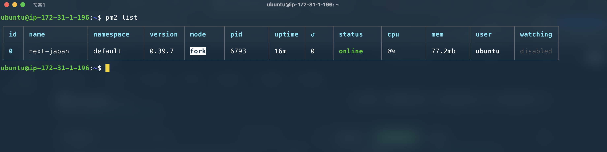
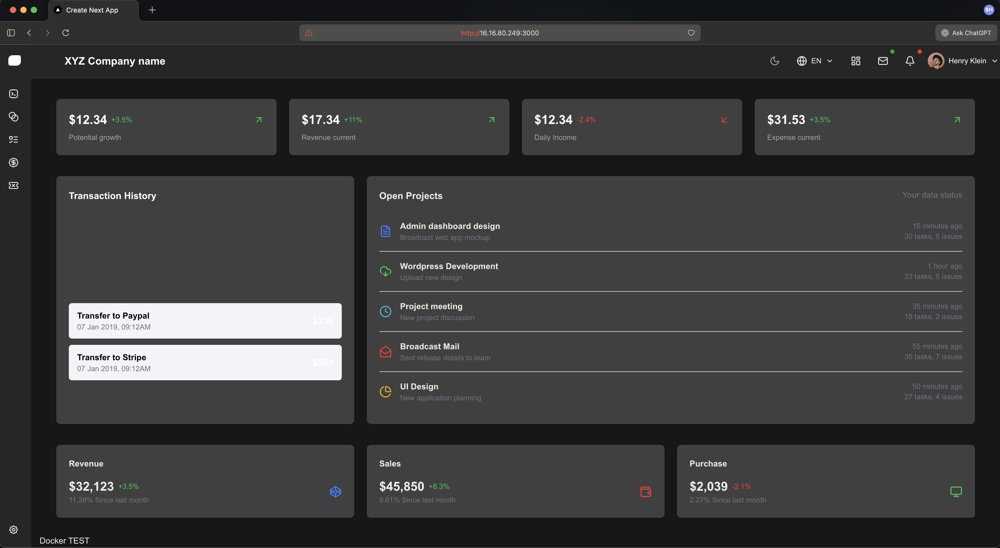

# Module 3 Assignment: Next.js EC2 Deployment

## 📋 Table of Contents

-   [Project Overview](#project-overview)
-   [Live Demo](#live-demo)
-   [Architecture](#architecture)
-   [Prerequisites](#prerequisites)
-   [EC2 Setup](#ec2-setup)
-   [Deployment Guide](#deployment-guide)
-   [Process Management](#process-management)
-   [Screenshots](#screenshots)
-   [Challenges & Solutions](#challenges--solutions)
-   [Key Learnings](#key-learnings)

---

## Project Overview

This project demonstrates the complete deployment pipeline of a **Next.js** application on **AWS EC2**, utilizing **PM2** for process management and monitoring. The deployment showcases industry-standard DevOps practices including cloud infrastructure setup, automated process management, and production monitoring.

### Tech Stack

-   **Frontend Framework:** Next.js
-   **Cloud Platform:** AWS EC2
-   **Operating System:** Ubuntu 24.04 LTS
-   **Process Manager:** PM2
-   **Version Control:** Git
-   **Runtime:** Node.js LTS

---

## Live Demo

🌐 **Application URL:** http://16.16.80.249:3000

> **Note:** The application is running in production mode, managed by PM2 for automatic restarts and monitoring.

---

## Architecture

```
┌─────────────────────────────────────────────────┐
│              Internet Traffic                   │
└──────────────────┬──────────────────────────────┘
                   │
                   ▼
         ┌─────────────────────-┐
         │   Security Group     │
         │  ┌───────────────┐   │
         │  │ SSH (22)      │   │
         │  │ HTTP (80)     │   │
         │  │ HTTPS (443)   │   │
         │  │ Custom (3000) │   │
         │  └───────────────┘   │
         └──────────┬───────────┘
                    │
                    ▼
         ┌─────────────────────┐
         │   EC2 Instance      │
         │   (t3.medium)       │
         │  ┌───────────────┐  │
         │  │   PM2 Manager │  │
         │  │      ↓        │  │
         │  │ Next.js App   │  │
         │  │  (Port 3000)  │  │
         │  └───────────────┘  │
         └─────────────────────┘
```

---

## Prerequisites

Before starting the deployment, ensure you have:

-   AWS Account with appropriate permissions
-   EC2 Key Pair (`.pem` file) for SSH access
-   Basic understanding of Linux commands
-   Git repository with Next.js application

---

## EC2 Setup

### Step 1: Launch EC2 Instance

**Instance Configuration:**

-   **Instance Type:** `t3.medium` (2 vCPU, 4 GB RAM)
-   **AMI:** Ubuntu 24.04 LTS (64-bit x86)
-   **Storage:** 50 GB gp3 root volume
-   **Region:** eu-north-1 (Stockholm)

### Step 2: Configure Security Group

Create inbound rules to allow necessary traffic:

| Type       | Protocol | Port Range | Source    | Purpose              |
| ---------- | -------- | ---------- | --------- | -------------------- |
| SSH        | TCP      | 22         | 0.0.0.0/0 | Remote server access |
| HTTP       | TCP      | 80         | 0.0.0.0/0 | Web traffic          |
| HTTPS      | TCP      | 443        | 0.0.0.0/0 | Secure web traffic   |
| Custom TCP | TCP      | 3000       | 0.0.0.0/0 | Next.js application  |

### Step 3: Connect to Instance

```bash
ssh -i "project-server.pem" ubuntu@ec2-16-16-80-249.eu-north-1.compute.amazonaws.com
```

**Alternative connection using public IP:**

```bash
ssh -i "project-server.pem" ubuntu@16.16.80.249
```

---

## Deployment Guide

### Phase 1: Environment Setup

```bash
# Update system packages
sudo apt update && sudo apt upgrade -y

# Install NVM (Node Version Manager)
curl -o- https://raw.githubusercontent.com/nvm-sh/nvm/v0.39.7/install.sh | bash

# Reload shell configuration
source ~/.bashrc

# Install Node.js LTS version
nvm install --lts
nvm use --lts

# Verify Node.js installation
node --version
npm --version

# Install PM2 globally
npm install pm2 -g
```

### Phase 2: Project Deployment

```bash
# Clone the repository
git clone https://github.com/sourabhossain/next-japan.git
cd next-japan

# Install project dependencies
npm install

# Build the Next.js application for production
npm run build

# Start the application with PM2
pm2 start npm --name "next-japan" -- run start

# Save PM2 process list (survives system reboot)
pm2 save

# Set PM2 to start on system boot
pm2 startup
```

---

## Process Management

### Monitoring Commands

```bash
# View all running PM2 processes
pm2 list

# View real-time logs for the application
pm2 logs next-japan

# View logs with timestamp
pm2 logs next-japan --lines 100

# Open interactive monitoring dashboard
pm2 monit

# Display detailed process information
pm2 show next-japan

# Check application status
pm2 status
```

### Management Commands

```bash
# Restart the application
pm2 restart next-japan

# Stop the application
pm2 stop next-japan

# Delete process from PM2
pm2 delete next-japan

# Restart all PM2 processes
pm2 restart all

# Reload with zero-downtime
pm2 reload next-japan
```

---

## Screenshots

### PM2 Process List

Below shows the application running successfully with PM2 managing the process:



_Figure 1: PM2 dashboard showing next-japan application in online status_

### Live Application

The Next.js application accessible via public IP address:



_Figure 2: Next-Japan application successfully deployed and accessible_

---

## Challenges & Solutions

### 🔴 Challenge 1: Port 3000 Not Accessible

**Problem:**

-   Application showed as "online" in PM2
-   Unable to access `http://16.16.80.249:3000` from browser
-   Connection timeout errors

**Root Cause:**
Security Group was missing inbound rule for port 3000.

**Solution:**

1. Navigate to EC2 Console → Security Groups
2. Select the instance's security group
3. Add Inbound Rule:
    - Type: Custom TCP
    - Port: 3000
    - Source: 0.0.0.0/0 (or specific IP for production)
4. Save rules

**Result:** Application became immediately accessible.

### 🔴 Challenge 2: Memory Exhaustion During Build

**Problem:**

-   `npm install` command failed intermittently
-   PM2 process crashed with out-of-memory errors
-   Instance became unresponsive during builds

**Root Cause:**
Initial `t2.micro` instance had insufficient RAM (1GB) for Next.js build process.

**Solutions Implemented:**

**Option 1: Create Swap Space (Temporary Fix)**

```bash
# Create 2GB swap file
sudo fallocate -l 2G /swapfile
sudo chmod 600 /swapfile
sudo mkswap /swapfile
sudo swapon /swapfile

# Make swap permanent
echo '/swapfile none swap sw 0 0' | sudo tee -a /etc/fstab
```

**Option 2: Upgrade Instance Type (Permanent Fix)**

-   Upgraded from `t2.micro` (1GB RAM) to `t3.medium` (4GB RAM)
-   Ensured smooth builds and stable process execution

**Result:** Build process completed successfully with adequate resources.

---

## Key Learnings

### Technical Skills Gained

1. **Cloud Infrastructure:** Hands-on experience with AWS EC2 instance provisioning and configuration
2. **Security:** Understanding of Security Groups and network access control
3. **Process Management:** Proficiency in PM2 for production application management
4. **Linux Administration:** Server setup, package management, and troubleshooting
5. **DevOps Practices:** Complete deployment pipeline from code to production

### Best Practices Applied

-   ✅ Used PM2 for automatic process restarts and monitoring
-   ✅ Configured proper security group rules for controlled access
-   ✅ Implemented production build before deployment
-   ✅ Set up PM2 startup script for reboot persistence
-   ✅ Documented deployment process for reproducibility

---

## Conclusion

This assignment successfully demonstrates the deployment of a modern web application on AWS infrastructure. The project covered essential DevOps concepts including cloud provisioning, security configuration, process management, and troubleshooting—all critical skills for production deployments.

**Project Repository:** [next-japan](https://github.com/sourabhossain/next-japan)

---

_Assignment completed as part of Module 3: Cloud Deployment & DevOps_
